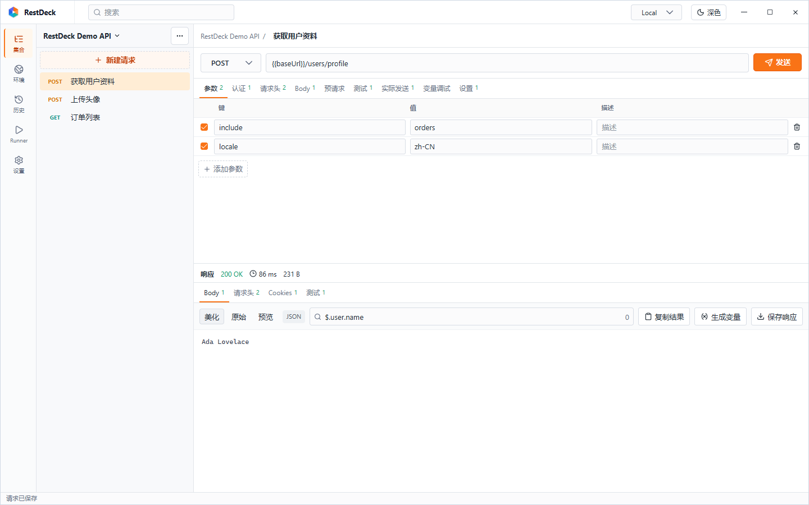
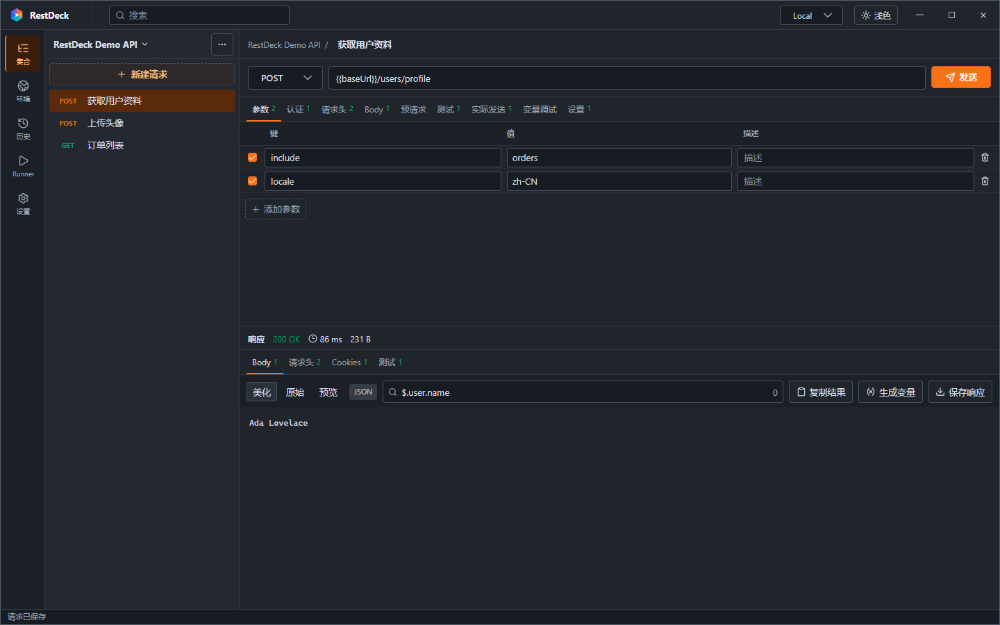
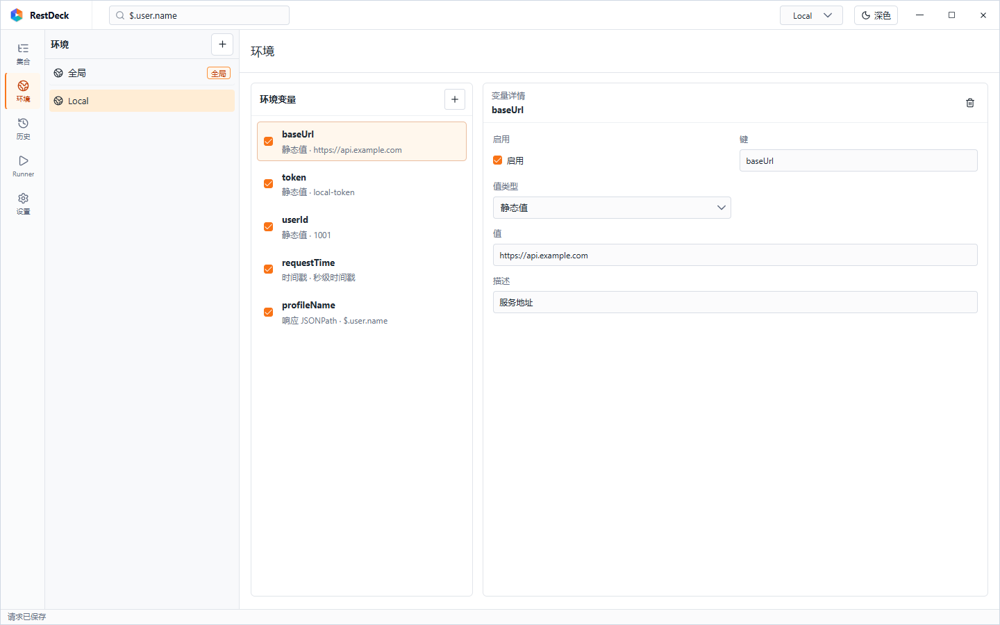
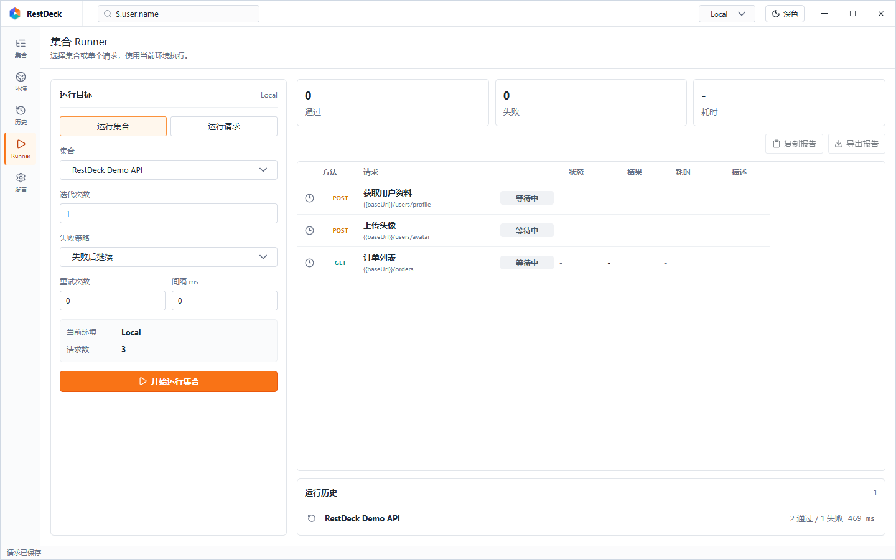
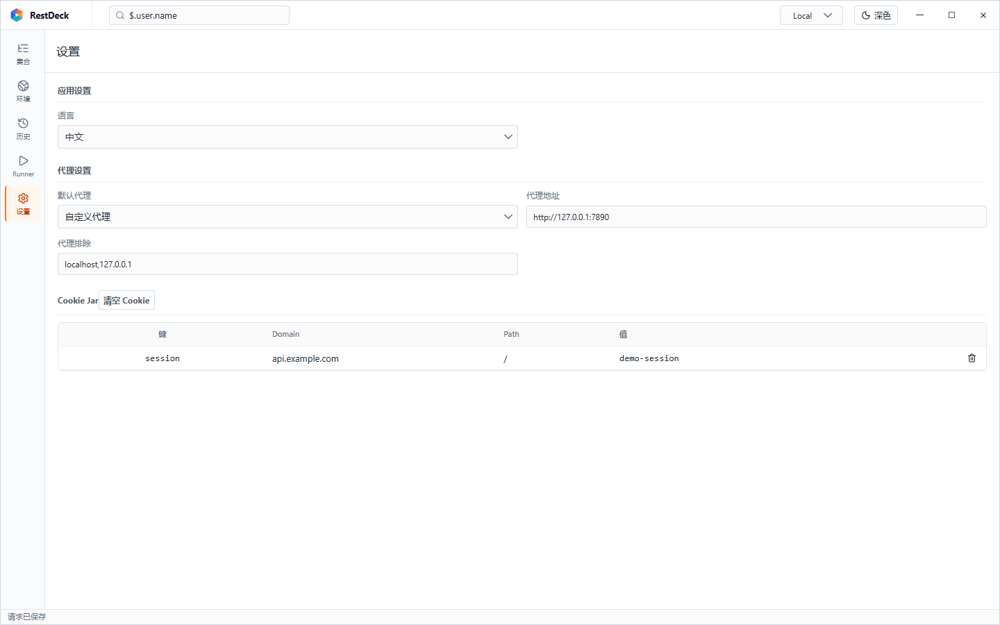
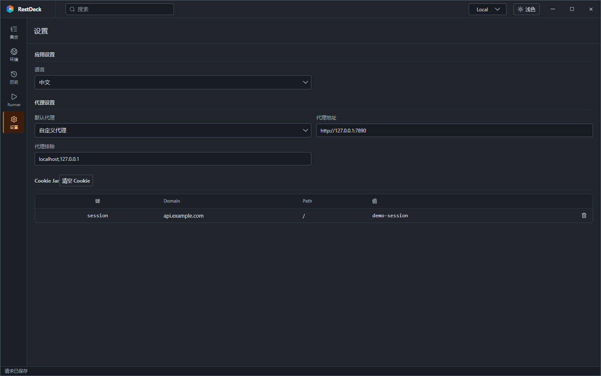

# RestDeck

RestDeck 是一个本地优先的桌面 API 调试工具，专注 HTTP 请求调试、集合运行、环境变量、导入导出和响应数据提取。

## 界面截图

### 请求工作台

### 暗色模式

### 环境变量

### 集合 Runner

### 设置

## 功能

### 请求调试

- 支持创建、复制、置顶、删除、导入、导出和生成代码。
- 支持 GET、POST、PUT、PATCH、DELETE 等常用 HTTP Method。
- 支持 URL、查询参数、请求头、Cookie、认证、Body、预请求脚本、测试脚本和超时时间配置。
- 支持 Params、Headers、Cookies 等表格化编辑，修改后自动保存。
- 支持 JSON Body 编辑、美化和语法高亮。
- 支持 form 请求体，包含文本字段和本地文件上传字段。
- 支持请求级代理配置，可继承默认代理、禁用代理或使用独立代理。
- 支持生成 cURL、Fetch、Node.js、Python、Go、C#、Java 等常用代码片段。

### 响应查看

- 展示响应状态码、耗时、响应大小和内容类型。
- 支持查看响应 Body、响应头、Cookies 和测试结果。
- 支持响应正文原始视图、格式化视图和 JSON 高亮。
- 支持在同一个输入框中搜索响应内容或输入 JSONPath 查询。
- 输入 `$` 开头时可显示根据响应内容生成的 JSONPath 候选。
- JSONPath 查询结果可直接展示、格式化、复制，并可生成环境变量。
- 响应区域支持拖动调整高度。

### 集合与 Runner

- 支持集合创建、重命名、删除、导入和导出。
- 支持从 Postman Collection、cURL、Fetch、HAR、OpenAPI/Swagger URL 导入。
- 支持导出集合内容到文件。
- 支持按集合或单个请求运行。
- Runner 可展示等待中、运行中、通过、失败等请求状态。
- Runner 支持迭代次数、当前环境、运行统计和结果导出。

### 环境与变量

- 支持全局变量和多环境变量。
- 支持新增、重命名、删除环境。
- 支持静态值、时间戳和从请求响应 JSONPath 读取变量值。
- 响应变量支持读取最新历史、每次读取前请求、超时后重新请求。
- 输入框支持 `{{变量}}` 候选提示和插入。
- 支持动态变量，如 `$guid`、`$timestamp`、`$isoTimestamp`、`$randomInt`、`$randomBoolean`、`$randomEmail` 等。
- 环境和变量修改自动保存。

### 导入导出

- 支持从 Postman Collection JSON 导入集合。
- 支持从浏览器 Copy as cURL / Copy as Fetch 导入请求。
- 支持通过 OpenAPI / Swagger URL 导入接口。
- 支持从 HAR 内容导入请求。
- 支持导出集合 JSON，并保存到本地文件。

### 设置与本地数据

- 支持浅色和暗色主题切换。
- 支持中文和英文界面。
- 支持默认代理和代理排除规则。
- 支持 Cookie Jar 设置。
- 数据保存到程序同目录的 `Data` 文件夹。
- 敏感字段使用本地加密封装保存。
- 支持 Windows 自定义标题栏、窗口拖动、最小化、最大化和关闭。
